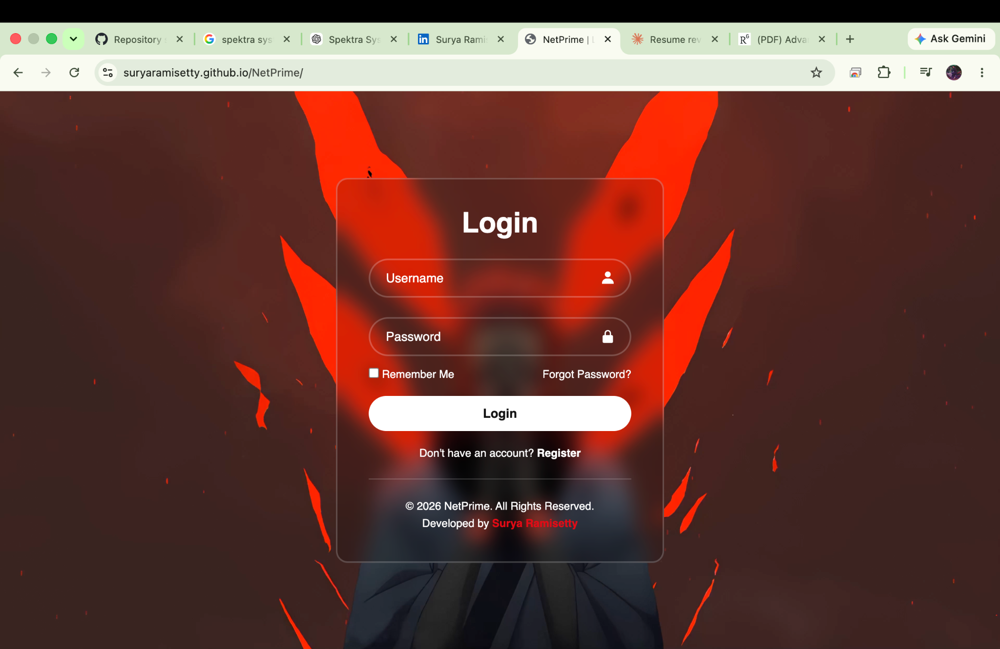
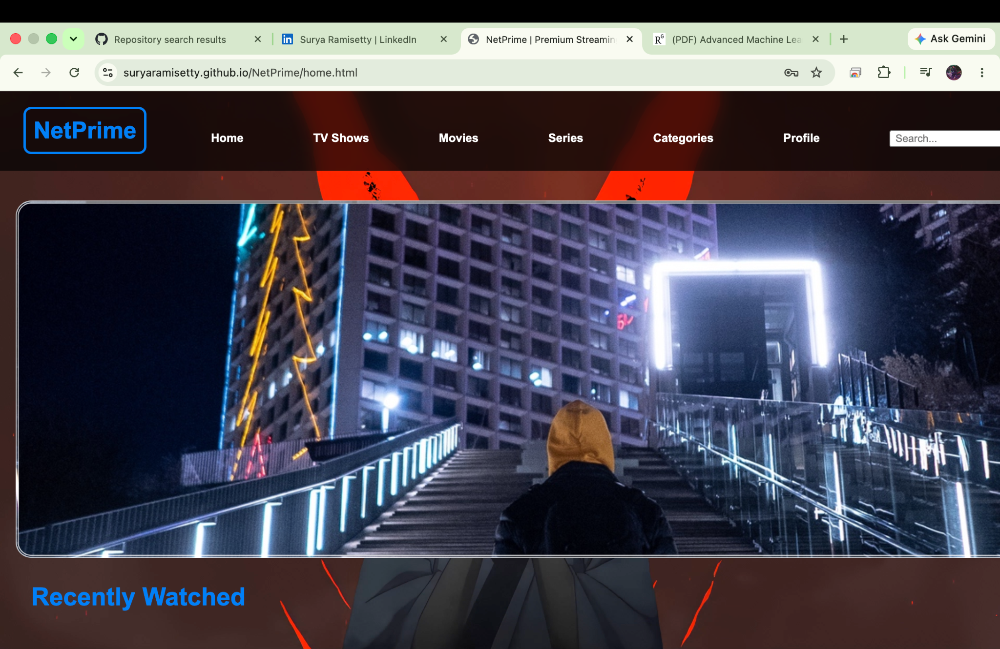
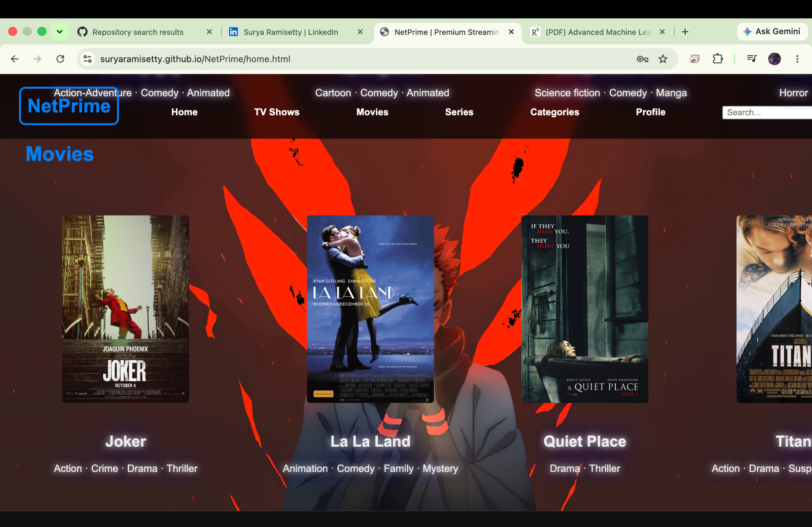
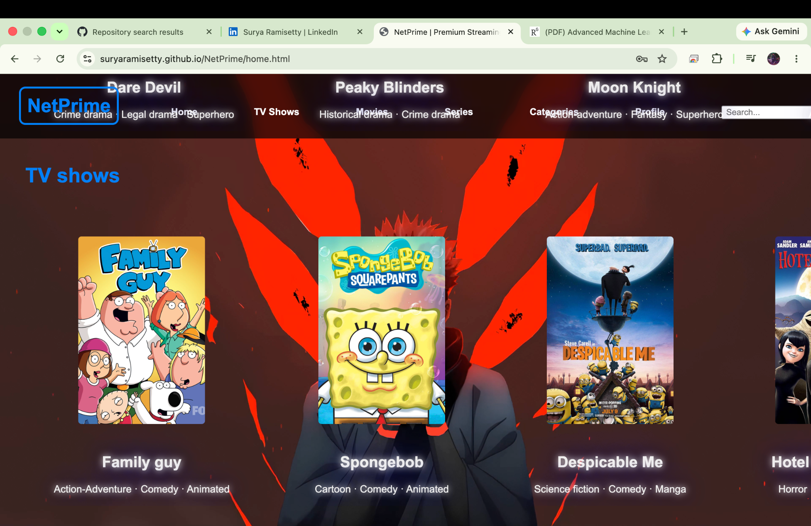

# 🎬 NetPrime

A modern premium movie streaming web application inspired by Netflix, built using **HTML, CSS, and JavaScript**. NetPrime provides a stylish UI with animated backgrounds, categorized movies, TV shows, series, profile page, and a secure demo login.

---

## 🌐 Live Demo

🔗 https://suryaramisetty.github.io/NetPrime/

---

## 🔐 Demo Login Credentials

| Username | Password |
|----------|----------|
| surya | surya |

> These credentials are provided only for demonstration purposes.

---

## ✨ Features

- 🔐 Login Authentication
- 🎥 Animated Video Background
- 🎬 Movies Collection
- 📺 TV Shows
- 🎭 Series
- 📂 Categories
- 👤 User Profile
- 🔍 Navigation Bar
- 📱 Responsive Design
- 🎨 Modern Glassmorphism UI
- ⚡ Smooth Hover Animations
- 📺 Netflix-inspired Interface

---

## 🛠 Technologies Used

- HTML5
- CSS3
- JavaScript
- BoxIcons
- GitHub Pages

---

## 📁 Project Structure

```
NetPrime
│
├── index.html
├── home.html
├── movies.html
├── tvshows.html
├── series.html
├── profile.html
├── categories.html
│
├── style.css
├── script.js
│
├── Pictures/
├── movie thumbnails/
├── categories thumbnails/
└── video backgrounds/
```

---

## 🚀 Installation

Clone the repository

```bash
git clone https://github.com/SuryaRamisetty/NetPrime.git
```

Open

```
index.html
```

in your browser.

---

## 📸 Screenshots

### 🔐 Login Page



---

### 🏠 Home Page



---

### 🎬 Movies



---

### 📺 TV Shows


---

## 👨‍💻 Developer

**Surya Ramisetty**

Computer Science & Engineering (AI & ML)

SRM Institute of Science and Technology

GitHub:
https://github.com/SuryaRamisetty

---

## 📜 Copyright

© 2026 NetPrime. All Rights Reserved.

This project is developed for educational and portfolio purposes only.

Movie posters, logos, videos, and media belong to their respective copyright owners.

No copyright infringement is intended.

---

## ⭐ Support

If you like this project, consider giving it a ⭐ on GitHub.
